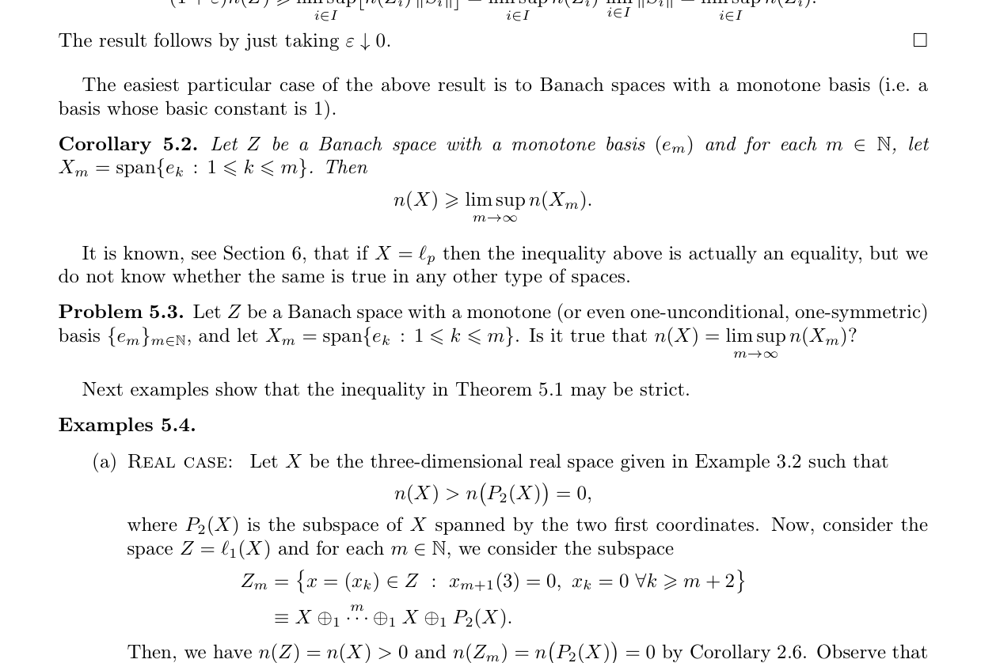

# Counterexample: Initial Segments of a Monotone Basis Need Not Recover the Numerical Index

status: counterexample_likely_valid
source_arxiv_id: 1003.3269
source_title: Numerical index of absolute sums of Banach spaces
source_authors: Miguel Martin, Javier Meri, Mikhail Popov, Beata Randrianantoanina
result_type: counterexample
updated_at: 2026-06-28

## Claim

Problem 5.3 of arXiv:1003.3269 asks whether, for a Banach space \(Z\) with a monotone basis \((e_m)\), the initial coordinate spaces \(X_m=\operatorname{span}\{e_1,\ldots,e_m\}\) satisfy
\[
n(Z)=\limsup_m n(X_m).
\]

The answer is no. There is a real Banach space \(Z\) with a one-unconditional monotone basis such that
\[
n(Z)>0,\qquad n(X_m)=0\quad(m\ge 2).
\]
There is also a complex one-unconditional version with \(n(Z)=1\) and \(\limsup_m n(X_m)<1\).

This does not settle the stronger variant where the basis is required to be one-symmetric.

## Source Crop

## Idea

The source paper already builds \(Z=\ell_1(X)\) and special increasing one-complemented subspaces with smaller numerical index. The only missing ingredient is to make those subspaces actual initial coordinate spans. Reorder the one-unconditional basis of \(\ell_1(X)\): list two coordinates of a block, then list two coordinates of the next block before closing the previous block. From the second initial segment onward, some block contributes exactly the two-dimensional Hilbert coordinate plane, whose numerical index is zero. Since finite \(\ell_1\)-sums have numerical index equal to the minimum of the summands, every large initial segment has numerical index zero, while the whole space still has numerical index \(n(\ell_1(X))=n(X)>0\).

## Verification Notes

- Uses only results from the source paper: Example 3.2, Corollary 2.6 for \(\ell_1\)-sums, and the one-unconditional coordinate structure.
- The proof is non-computational.
- Bounded novelty search on 2026-06-28 used exact phrases from Problem 5.3 and nearby variants: `"Numerical index of absolute sums of Banach spaces" "monotone" "basis" "limsup"`, `"n(X) = limsup" "numerical index" "monotone basis"`, and `"numerical index" "dense increasing" "one-complemented subspaces"`. Only the original arXiv paper surfaced as an exact match.

## Files

- `main.tex`: full proof packet.
- `solution_packet.pdf`: rendered packet.
- `source_paper.pdf`: local copy of arXiv:1003.3269.
- `figures/open_problem_and_source_example_crop.png`: source crop.
