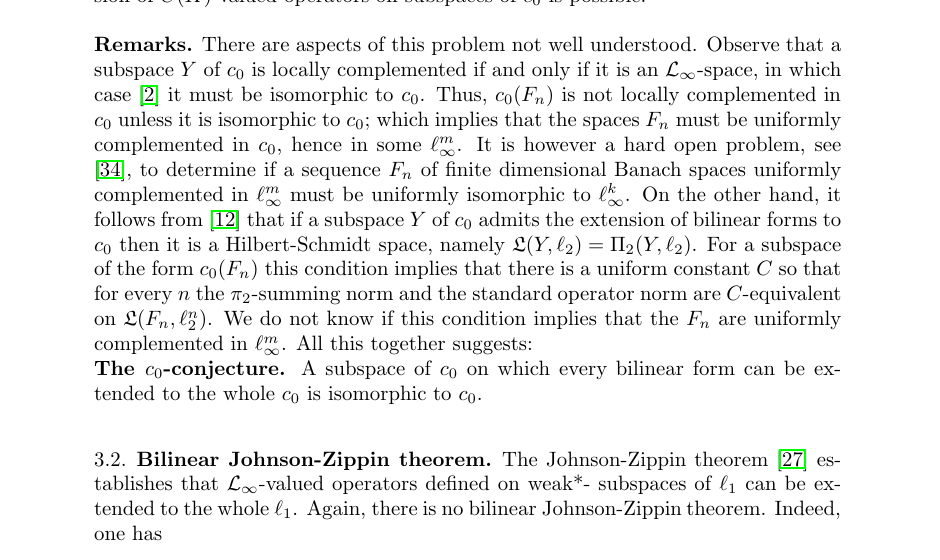

# Counterexample: Hilbert-Schmidt Block Condition Does Not Force \(L_\infty\)-Complementability

status: candidate_counterexample_likely_valid
source_arxiv_id: 1106.5089
source_title: Local complementation and the extension of bilinear mappings
source_authors: J. M. F. Castillo, A. Defant, R. Garcia, D. Perez-Garcia, J. Suarez
result_type: counterexamples
updated_at: 2026-06-29

## Claim

In the remarks leading to the \(c_0\)-conjecture, the source asks whether the finite-dimensional Hilbert-Schmidt necessary condition
\[
\pi_2(T)\le C\|T\|,\qquad T:F_n\to \ell_2^n,
\]
forces the blocks \(F_n\) to be uniformly complemented in finite-dimensional \(\ell_\infty\) spaces.

It does not. The blocks \(F_n=\ell_1^n\) satisfy this condition uniformly, by Grothendieck's inequality, but they are not uniformly complemented in any finite-dimensional \(\ell_\infty^{m(n)}\) spaces.

## Scope

This is not a proof or disproof of the full \(c_0\)-conjecture. It removes one finite-dimensional route suggested by the source: the Hilbert-Schmidt necessary condition alone is too weak to imply uniform \(L_\infty\)-complementability of the blocks.

## Source Crop

## Verification Notes

- The analytic core is the standard positive-Grothendieck estimate for \(T:\ell_1^n\to H\).
- The non-complementability part uses the classical fact that the absolute projection constants of \(\ell_1^n\) tend to infinity, in fact with order \(\sqrt n\).
- Bounded novelty search on 2026-06-29 checked the local run indexes, the two previous `1106.5089` attempts, the local parsed source corpus, and web queries for the exact phrase `"We do not know if this condition implies" "F_n" "uniformly complemented"`, Hilbert-Schmidt block keywords, and `gamma(ell_1^n)`. No prior packet or exact later answer was found. Novelty confidence is modest because the proof combines classical facts and may be folklore.

## Files

- `main.tex`: proof packet.
- `solution_packet.pdf`: rendered proof packet.
- `source_paper.pdf`: local copy of arXiv:1106.5089.
- `figures/open_problem_crop.png`: source crop with the finite-dimensional question and \(c_0\)-conjecture.
