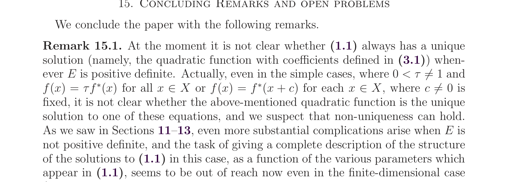

# Counterexample: Nonunique Positive-Definite Fixed Point for \(f=\tau f^*\)

status: counterexample_likely_valid
source_arxiv_id: 1708.00464
source_title: Fixed points of Legendre-Fenchel type transforms
source_authors: Alfredo N. Iusem, Daniel Reem, Simeon Reich
result_type: counterexample
updated_at: 2026-06-28

## Claim

Remark 15.1 of arXiv:1708.00464 asks whether, when \(E\) is positive definite, the fixed point equation always has the unique quadratic solution. It explicitly singles out the simple case
\[
f(x)=\tau f^*(x),\qquad 0<\tau\ne 1,
\]
as unclear.

The answer is negative. For every \(\tau>0\), \(\tau\ne1\), there are nonquadratic differentiable proper lower semicontinuous convex functions \(f:\mathbb R\to\mathbb R\) satisfying
\[
f=\tau f^*.
\]

## Source Crop

## Idea

For a differentiable strictly convex \(f\), the equation \(f=\tau f^*\) is equivalent, up to the additive constant, to
\[
f'(x)=\tau (f')^{-1}(x).
\]
Thus it is enough to build a non-linear increasing homeomorphism \(h:\mathbb R\to\mathbb R\) with
\[
h^{-1}(x)=h(x)/\tau.
\]
On the positive half-line, pass to logarithmic coordinates. This reduces the problem to constructing a non-linear increasing homeomorphism \(R\) of \(\mathbb R\) with \(R^2(u)=u-\log\tau\). Such square roots of translations are abundant: conjugate the half-translation by a nontrivial periodic perturbation of the identity.

## Verification Notes

- The proof is analytic, not computational.
- `code/log_periodic_checker.py` numerically samples the constructed derivative \(h\) and checks \(h(h(x)/\tau)=x\) for a concrete \(\tau\) and periodic perturbation.
- Bounded novelty search on 2026-06-28 used exact phrases including `"f = tau f*" Legendre Fenchel nonunique solution`, `"f(x)=\\tau f^*(x)" convex conjugate nonquadratic`, `"Fixed points of Legendre-Fenchel type transforms" "non-uniqueness" "tau"`, and `"f=alpha f^*" "convex conjugate"`. No explicit later solution of this simple positive-definite uniqueness question was found.

## Files

- `main.tex`: proof packet.
- `solution_packet.pdf`: rendered proof packet.
- `source_paper.pdf`: local copy of arXiv:1708.00464.
- `figures/open_problem_crop.png`: source crop.
- `code/log_periodic_checker.py`: optional numerical sanity check.
