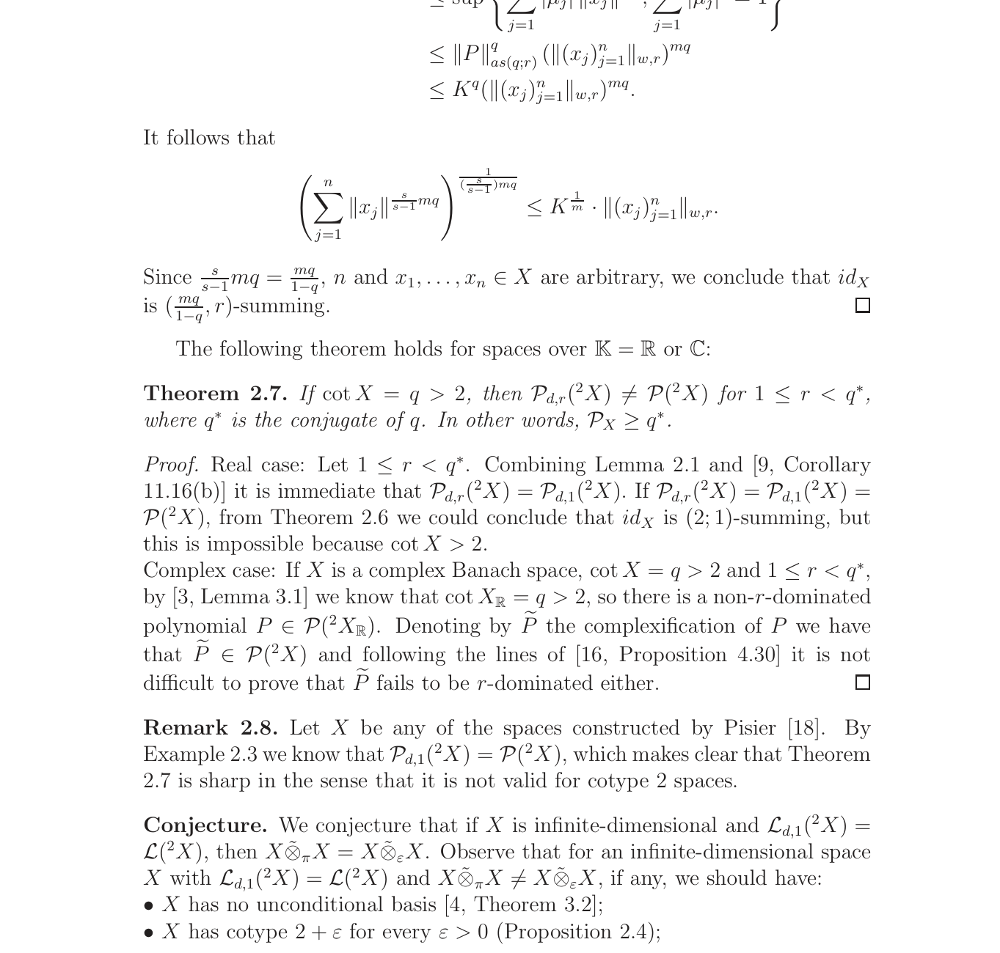
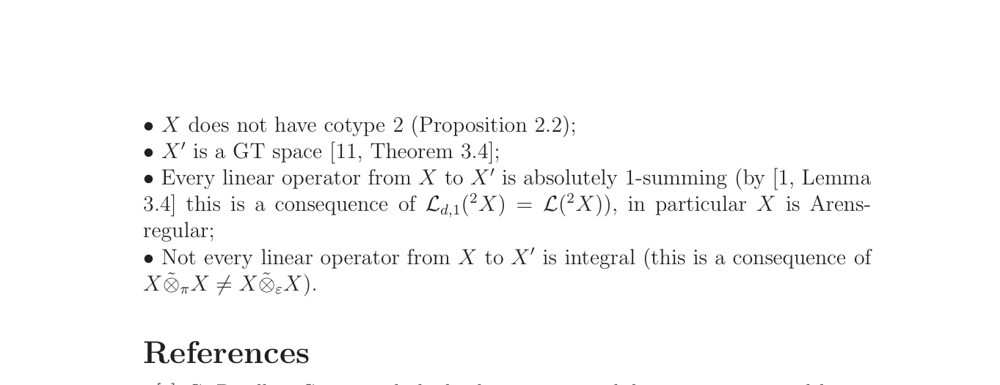

# Full Solution: Dominated Bilinear Forms Force Tensor Norm Equality

status: candidate_full_solution_likely_valid
source_arxiv_id: 0905.2079
source_title: Dominated bilinear forms and 2-homogeneous polynomials
source_authors: Geraldo Botelho, Daniel Pellegrino, Pilar Rueda
result_type: full
updated_at: 2026-06-28

## Claim

The final conjecture of arXiv:0905.2079 states that if \(X\) is infinite-dimensional and every continuous bilinear form on \(X^2\) is 1-dominated, then
\[
X\widehat\otimes_\pi X = X\widehat\otimes_\varepsilon X.
\]

The packet proves the conjecture. In fact, the infinite-dimensional hypothesis is not needed.

## Idea

For a bilinear form \(A(x,y)=T(x)(y)\), 1-domination implies that \(T:X\to X^*\) is absolutely 1-summing. Apply this to the transposed bilinear form as well, so the transpose operator \(T^\tau(y)(x)=T(x)(y)\) is 1-summing.

Local reflexivity transfers finite pieces of \(X^{**}\) back into \(X\) while preserving the finitely many functionals \(Tx_i\). This shows that \(T^*:X^{**}\to X^*\) is absolutely 1-summing. By the standard duality theorem for integral operators, \(T\) is integral. Hence every bilinear form on \(X^2\) is integral, which is exactly the assertion that the projective and injective tensor completions coincide.

## Source Crops

## Verification Notes

- The proof is analytic; no numerical computation is used.
- The main verifier focus should be the local-reflexivity estimate proving that \(T^*\) is 1-summing from the 1-summing property of the transpose \(T^\tau\).
- Bounded novelty search on 2026-06-28 used the local run indexes, local parsed arXiv sources, and web queries including `"all bilinear forms" "1-dominated" Banach space`, `"Dominated bilinear forms and 2-homogeneous polynomials" conjecture`, `"T:X to X* is 1-summing then T is integral"`, and `"absolutely 1-summing" "X*" "local reflexivity"`. No later explicit solution of the conjecture was found in that search.

## Files

- `main.tex`: proof packet.
- `solution_packet.pdf`: rendered proof packet.
- `source_paper.pdf`: local copy of arXiv:0905.2079.
- `figures/open_problem_crop_page6.png`: source crop with the conjecture.
- `figures/open_problem_crop_page7.png`: source crop with the continuation.
