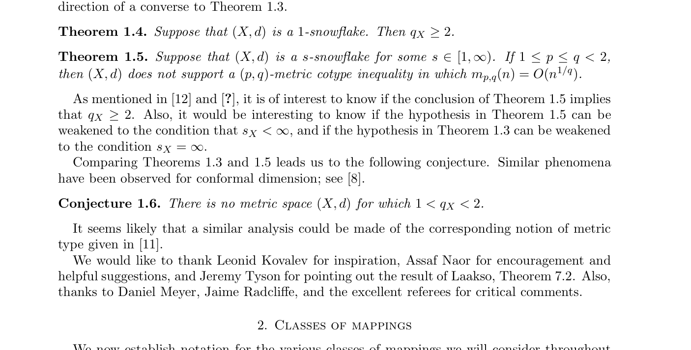

# Full Solution: Metric Cotype Has No Gap Between 1 and 2

status: candidate_full_solution_likely_valid
source_arxiv_id: 1001.3326
source_title: Spaces of small metric cotype
source_authors: Ellen Veomett, Kevin Wildrick
result_type: full
updated_at: 2026-06-28

## Claim

Conjecture 1.6 of arXiv:1001.3326 states that there is no metric space \((X,d)\) for which
\[
1<q_X<2,
\]
where \(q_X\) is the infimum of the metric cotype exponents supported by \(X\).

The packet proves the conjecture.

## Idea

The source paper proves that if the snowflake index is exactly \(s_X=1\), then \(q_X\ge 2\). The missing case is \(s_X>1\).

If \(d^s\) is a metric for some \(s>1\), then for every \(1<q\le s\), \(d^q\) is also a metric. For the metric \(\rho=d^q\), a path around each coordinate circle in \(\mathbb Z_m^n\) gives
\[
\mathbb E_\epsilon\sum_j \rho(f(\epsilon),f(\epsilon+m e_j/2))
\le \frac m2 \mathbb E_\epsilon\sum_j \rho(f(\epsilon),f(\epsilon+e_j)).
\]
The random \(\delta\in\{-1,0,1\}^n\) average sees each one-step direction with probability \(3^{-n}\). Choosing \(m(n)\) exponentially large in \(n\) absorbs this factor and gives a \((q,q)\)-metric cotype inequality. Hence \(q_X=1\) whenever \(s_X>1\). Combining with the source theorem for \(s_X=1\) gives the dichotomy \(q_X=1\) or \(q_X\ge2\).

## Source Crop

## Verification Notes

- The proof is analytic; no computation is used.
- The scaling function in the new lemma is exponential in \(n\). This is why the result does not contradict the source paper's Theorem 1.5, which rules out \(q<2\) only under the sharp-growth condition \(m_{p,q}(n)=O(n^{1/q})\).
- Bounded novelty search on 2026-06-28 used the local run indexes, local parsed arXiv sources, and web queries including `"Spaces of small metric cotype" "Conjecture 1.6"`, `"q_X" "s_X" "metric cotype"`, `"metric cotype" "snowflake index"`, and `"metric cotype" "d^q is a metric"`. No later explicit solution of Conjecture 1.6 was found.

## Files

- `main.tex`: proof packet.
- `solution_packet.pdf`: rendered proof packet.
- `source_paper.pdf`: local copy of arXiv:1001.3326.
- `figures/open_problem_crop.png`: source crop containing Conjecture 1.6.
