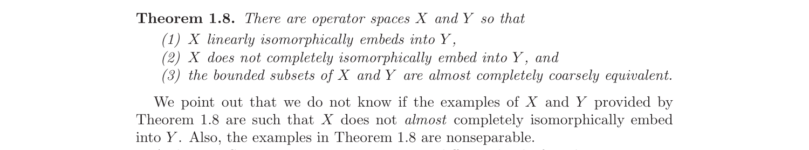

# Compact quotient-coordinate reduction for the original Kalton pair

Status: `partial_result_likely_valid`

Source: Bruno M. Braga, *Towards a theory of coarse geometry of operator
spaces*, arXiv:2106.15022, Theorem 1.8 and the paragraph immediately after it
(PDF page 4).

## Source question

For the explicit spaces in Theorem 1.8, determine whether `X` fails to almost
completely isomorphically embed into `Y`. In the construction,

- `H = R cap C`,
- `Q : L_infty[0,1] -> H` is the complete quotient dual to the standard
  complete embedding `R + C -> L_1[0,1]`,
- `Y = Z(Q) = (direct sum_j Y_j)_ell_1`, with
  `||y||_{Y_j} = max(2^{-j}||y||_infty, ||Qy||_H)`, and
- `X = H direct-sum ker(tilde Q)`.

It is enough to rule out an almost complete embedding of the complemented
`H` summand into `Z(Q)`.

## Partial result

For every bounded linear map `u : H -> Z(Q)`, write `u_j` for its `j`th
coordinate and set

`V_u x = (Q u_j x)_j in ell_1(H)`.

Then `V_u` is compact. Consequently, if `H` almost completely isomorphically
embeds into `Z(Q)`, then `H` almost completely isomorphically embeds into the
quotient-free operator space

`W = (direct sum_j MIN(L_infty[0,1]))_ell_1`.

This removes every `R cap C` quotient coordinate from a hypothetical positive
embedding, after passing at each matrix level to a completely isometric
infinite-dimensional Hilbert subspace. The original question is therefore
reduced to a uniform matrix-level obstruction for the fixed minimal sum `W`.

## Proof intuition

Each coordinate `Q u_j : ell_2 -> ell_2` must be compact. Otherwise it is
bounded below on an infinite-dimensional Hilbert subspace; composing the
inverse on that subspace with the orthogonal projection and `Q` would produce
a bounded projection from `L_infty` onto a copy of `ell_2`, which is
impossible. The coordinate map into `ell_1(ell_2)` is then compact by the
standard weak-compactness/tail criterion for vector-valued `ell_1` sums.

At a prescribed matrix level `n`, compactness lets us pass to an
infinite-dimensional subspace on which the quotient coordinates have scalar
norm `O(1/n)`. The general bound `||S_n|| <= n||S||` makes their `n`th
amplification negligible. The remaining minimal `L_infty` coordinates must
retain the lower embedding estimate.

## What remains open

The packet does **not** prove that `H` fails to almost completely embed into
`W`. That uniform minimal-sum obstruction is the remaining step, and hence the
exact original Theorem 1.8 examples are not claimed to be settled here.

Braga--Oikhberg, arXiv:2211.11854, explicitly gives the desired existential
strengthening using a different quotient
`MAX(L_1) -> MIN(ell_2)`. Its proof does not establish the assertion for the
original `L_infty -> R cap C` pair.

## Verification report

Verdict: `likely valid`.

- The compactness proof uses only: the Hilbert-space characterization of
  noncompact operators, the absence of complemented infinite-dimensional
  Hilbert subspaces in `L_infty`, and the weak-compactness/tail criterion in
  `ell_1(H)` for reflexive `H`.
- The passage to a small infinite-dimensional restriction uses finite-rank
  approximation of a compact operator.
- Unitary invariance of both row and column norms makes every
  infinite-dimensional Hilbert subspace completely isometric to `R cap C`.
- The canonical coordinate map from `Z(Q)` into the two `ell_1` sums has
  complete distortion at most `2`; constants in the reduction have ample
  slack.
- No computation is involved.

Primary human-review focus: confirm the complete-distortion-at-most-2 estimate
for the canonical coordinate map under the repository's convention for the
operator-space `ell_1` sum.

## Search and novelty scope

On 2026-07-19 the four local lightweight indexes were searched for
`2106.15022`, the title, the exact almost-complete-embedding phrase, and the
core `R cap C`/`ell_1`-sum terminology. The later local source
arXiv:2211.11854 and bounded web searches for the exact phrase and close
variants were also checked. They found the different-space existential
strengthening, but no explicit resolution of the exact original pair or this
compact quotient-coordinate reduction.

## Files

- `main.tex`: formal packet.
- `solution_packet.pdf`: rendered packet.
- `source_paper.pdf`: original arXiv paper.
- `figures/open_problem_crop.png`: source-page evidence.

## References

1. B. M. Braga, *Towards a theory of coarse geometry of operator spaces*,
   arXiv:2106.15022.
2. B. M. Braga and T. Oikhberg, *Coarse geometry of operator spaces and
   complete isomorphic embeddings into ell_1 and c_0-sums of operator spaces*,
   arXiv:2211.11854.
3. F. Albiac and N. J. Kalton, *Topics in Banach Space Theory*, 2nd ed.,
   Springer, 2016 (the complemented-subspace fact cited in the source paper).
